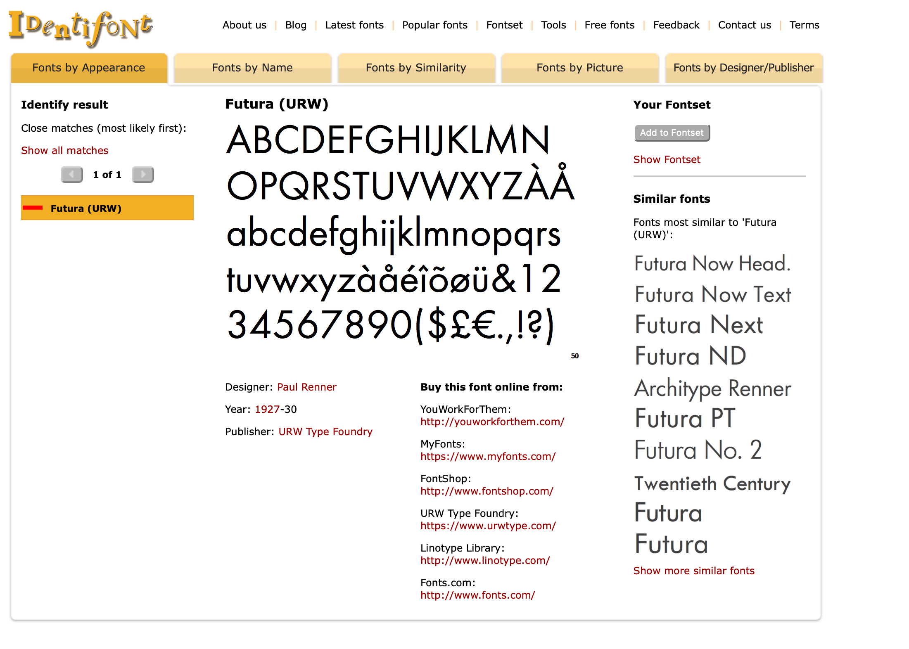

### Notes about the Figure style
First, the image is slightly tilted, and it's difficult to rotate perfectly straight. The following observations were made by measuring various things in a vector image editor program

#### Canvas
canvas dimensions are 3"x2.5" W:H
offsets are 0.23" left, 0.05" right, 0.2" bottom, 0.05" top, hspace = 0.05"
on [0,1] this is: .077, .983, .08, 0.98, hspace = .02

#### Subplot Axes
- axes bbox has all four sides
- the axes box is 2.72" x 1.10", with 1pt line thickness

#### Ticks
- it seems the ticks are inward facing and maybe .7-.8 pt thick  -- 0.75?
- ticks seem to be 0.07in long (maybe 0.065... but i dont' think so)
- x axis has 6 ticks, include two entirely side ones (4 in middle)
- y axis has 3 ticks, including two entirely side ones (1 in middle)

#### Tick Labels
- tick labels are font size 6 futura with 0% tracking
- tick labels (Y) are LHS .165" and RHS .035" from axis line
- tick labels (X) are TOP .032" and BOTTOM .105" from axis line

### Axis Labels
- axis label  (X) is  TOP .128" and BOTTOM .184" from axis line
- axis label is font size 8

### Lines
- plot lines are 1.25 pt
- dashed lines are 1.25 pt, with dash parameters of (.5, 1.5) (length,skip?)

### Fonts
- The font is Futura (medium)

- The font size is 7.75 pt
- The spacing btw lines is 11 pt font spacing
- any math/greek (〈𝓁Λ〉) letters are in some weird serif font... switch to MPL default (so go with dejavu serif or STIX Two)
- Sometimes long numbers have -75% tracking between letters
