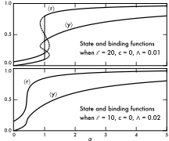
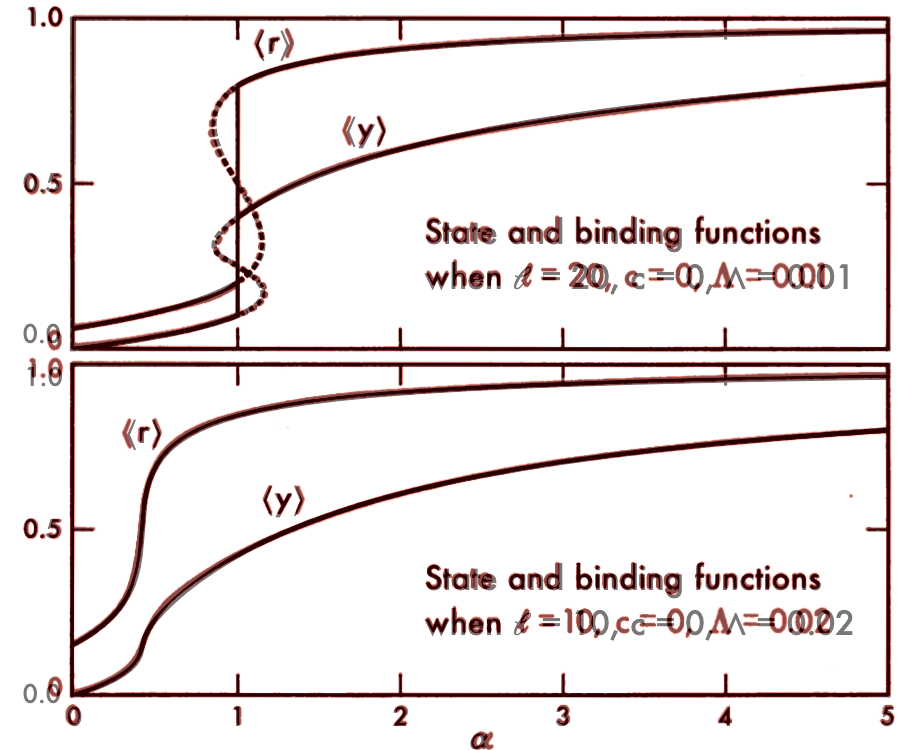

# oldplotlib
A Matplotlib stylesheet to replicate the figure style of Changeux and Kittel in:
>Changeux, J.-P., Thiery, J., Tung, Y. & Kittel, C. ON THE COOPERATIVITY OF BIOLOGICAL MEMBRANES. Proceedings of the National Academy of Sciences 57, 335–341 (1967).

Specifically, the style is



## How to Use
There are two ways to use this stylesheet for your figures

First, with down the [stylesheet](oldplotlib.mplstyle), then

``` Python
import matplotlib.pyplot as plt
plt.style.use('/path/to/the/oldplotlib.mplstyle')
```
The second way is a a simple wrapper over matplotlib.pyplot that essentially types the previous option in for you. Instead of doing `import matplotlib.pyplot as plt` in your file, use

``` Python
import oldplotlib as plt
```


## Development of oldplotlib
* [Observations about the figure](figure_observations.md)
* [Current style issues to be corrected](current_issues.md)
* [Current test figure code](test.py)


#### Overlap original (red) / oldplotlib (black):


